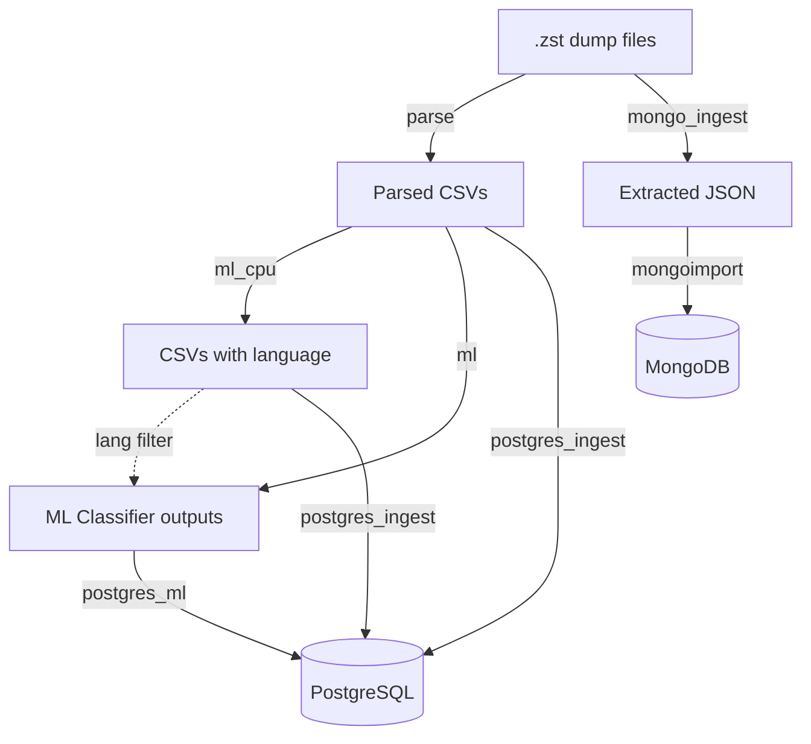

<div align="center">

# Social Data Bridge

[](https://www.docker.com/)
[](https://www.python.org/)
[](https://www.postgresql.org/)
[](https://www.mongodb.com/)
[](https://developer.nvidia.com/cuda-toolkit)

A Docker-based toolkit for large-scale processing, classification, and database ingestion of social media data dumps. Supports PostgreSQL (parsed CSVs) and MongoDB (raw JSON) as database destinations. Designed for the [Reddit data dumps](https://github.com/ArthurHeitmann/arctic_shift), with support for multiple platforms through a configurable architecture.

</div>

### TL;DR

```bash
# 1. Configure (auto-detects hardware, generates all config files)
python sdb.py setup

# 2. Run the pipeline
python sdb.py run parse              # Decompress .zst → parse JSON → CSV
python sdb.py run ml_cpu             # Language detection (Lingua, CPU)
python sdb.py run ml                 # GPU classifiers (toxicity, emotions)
python sdb.py start                  # Start database(s)
python sdb.py run postgres_ingest    # Ingest CSVs into PostgreSQL
python sdb.py run postgres_ml        # Ingest classifier outputs
python sdb.py run mongo_ingest       # Ingest raw JSON into MongoDB

# 3. Check progress
python sdb.py status
```

---

### Table of Contents

[◾ Overview](#-overview)
[◾ Requirements](#-requirements)
[◾ Quick Start](#-quick-start)
[◾ CLI Reference](#-cli-reference)
[◾ Profiles](#-profiles)
[◾ Platform Support](#-platform-support)
[◾ Storage Requirements](#-storage-requirements)
[◾ FAQ and Troubleshooting](#-faq-and-troubleshooting)

---

## ◾ Overview

**Social Data Bridge** provides a complete pipeline for working with large-scale social media data dumps:

- **Multi-platform support** — Reddit (with specialized features) or custom JSON/CSV platforms
- **Automatic detection and decompression** of `.zst` dump files
- **Parsing** JSON to clean CSVs with configurable field extraction
- **Modular classification** — CPU-based (Lingua) and GPU-based (transformers) with multi-GPU parallelization and language filtering
- **PostgreSQL ingestion** of parsed CSVs with finetuned settings and duplicate handling
- **MongoDB ingestion** of raw JSON/NDJSON directly after extraction, using `mongoimport` for fast bulk loading
- **Config-based** addition of new classifiers, platforms, and database backends

### Architecture



## ◾ Requirements

- [Python](https://www.python.org/) 3.10+ (for `sdb.py` CLI and setup scripts)
- [Docker Compose](https://docs.docker.com/compose/) v2
- Sufficient storage (see [Storage Requirements](#-storage-requirements))

> [!TIP]
> **For GPU classification:** [NVIDIA Container Toolkit](https://docs.nvidia.com/datacenter/cloud-native/container-toolkit/install-guide.html)

**Recommended for optimal performance:**
- Flash-based storage (NVMe SSDs strongly recommended)
- High core count CPU (8+)
- 64GB+ RAM
- NVIDIA GPU with 8GB+ VRAM (for `ml` profile)

> [!NOTE]
> The datasets are very large, and ML classification can take days to months for the full dataset. Check the benchmarks at [joaopn/encoder-optimization-guide](https://github.com/joaopn/encoder-optimization-guide) to estimate runtimes on your hardware.

## ◾ Quick Start

### Reddit Data (Default)

#### 1. Get monthly data dumps

Download the Reddit data dumps from [arctic_shift](https://github.com/ArthurHeitmann/arctic_shift/blob/master/download_links.md) and place the torrent directory in `data/dumps/`:

```
data/dumps/
├── submissions/
│   ├── RS_2024-01.zst
│   └── RS_2024-02.zst
└── comments/
    ├── RC_2024-01.zst
    └── RC_2024-02.zst
```

#### 2. Configure

Run the interactive setup to auto-detect your hardware and generate all configuration files:

```bash
python sdb.py setup
```

The setup walks you through core settings (paths, parse, PostgreSQL), optionally classifier tuning, and Reddit-specific field/index configuration — all with sensible defaults. It generates `.env`, `user.yaml` for each profile, and `postgresql.local.conf` (with optional [PGTune](https://pgtune.leopard.in.ua/) integration).

For manual configuration or to understand what each setting does, see the [Configuration Reference](docs/configuration.md).

#### 3. Run

Run the profiles in order. The setup prints the commands for your selection, but the full pipeline is:

```bash
python sdb.py run parse              # Parse Reddit data to CSV
python sdb.py run ml_cpu             # CPU language detection (Lingua)
python sdb.py run ml                 # GPU classifiers (optional, requires NVIDIA GPU)
python sdb.py start                  # Start configured database(s)
python sdb.py run postgres_ingest    # Ingest CSVs into PostgreSQL
python sdb.py run postgres_ml        # Ingest classifier outputs into PostgreSQL
python sdb.py run mongo_ingest       # Ingest raw JSON into MongoDB
```

Use `python sdb.py status` to check configuration and ingestion progress at any time.

#### 4. Analyze

With an optimized PostgreSQL database running, you can send large-scale analytical queries through:
- The terminal with [psql](https://www.postgresql.org/docs/current/app-psql.html)
- A GUI with [pgAdmin](https://www.pgadmin.org/) or [DBeaver](https://dbeaver.io/)
- LLMs with MCP servers such as [crystaldba/postgres-mcp](https://github.com/crystaldba/postgres-mcp)
- Agentic LLMs using [Agent Skills](https://platform.claude.com/docs/en/agents-and-tools/agent-skills/overview)

> [!IMPORTANT]
> By default, the database accepts local, read-write, unauthenticated connections with user `postgres`. For multiple users (human or AI), it is recommended to add a password or read-only users.

---

<details>
<summary><h2>◾ CLI Reference</h2></summary>

All operations go through `sdb.py`:

```
python sdb.py <command> [options]
```

### Configuration

| Command | Description |
|---------|-------------|
| `sdb.py setup` | Full interactive configuration: core → classifiers → platform |
| `sdb.py setup-reddit` | Configure Reddit fields, indexes, and schema |
| `sdb.py add-classifiers` | Configure Lingua and GPU classifier settings |
| `sdb.py unsetup` | Remove all generated configuration and optionally delete the database |

`setup` is the main entrypoint — it runs core configuration first, then optionally walks you through classifier and platform setup. The individual commands (`setup-reddit`, `add-classifiers`) can be re-run independently to update specific settings.

`unsetup` removes all generated files (`.env`, `user.yaml` overrides, `setup_state.yaml`, etc.). Database deletion requires two separate confirmations. Data files (CSVs, dumps, classifier outputs) are never deleted — their locations are printed for manual cleanup.

### Pipeline

| Command | Description |
|---------|-------------|
| `sdb.py run <profile>` | Run a pipeline profile |
| `sdb.py run <profile> --build` | Rebuild the Docker image before running |
| `sdb.py start [service]` | Start configured databases (postgres, mongo, or all) |
| `sdb.py stop [service]` | Stop configured databases (postgres, mongo, or all) |
| `sdb.py status` | Show configuration and ingestion progress |

Valid profiles: `parse`, `ml_cpu`, `ml`, `postgres_ingest`, `postgres_ml`, `mongo_ingest`.

`status` reads pipeline state files to show ingestion progress (datasets processed, in-progress, failed) without querying the database.

</details>

## ◾ Profiles

| Profile | Description | Input | Output |
|---------|-------------|-------|--------|
| `parse` | Decompress `.zst`, parse JSON to CSV | `.zst` dump files | `CSV_PATH/` |
| `ml_cpu` | Lingua language detection (CPU) | Parsed CSVs | `OUTPUT_PATH/lingua/` |
| `ml` | Transformer classifiers (GPU) | Parsed CSVs + Lingua output | `OUTPUT_PATH/{classifier}/` |
| `postgres` | PostgreSQL database server | — | — |
| `postgres_ingest` | Ingest CSVs into PostgreSQL | Parsed CSVs (or Lingua CSVs) | PostgreSQL tables |
| `postgres_ml` | Ingest ML outputs into PostgreSQL | Classifier output CSVs | PostgreSQL tables |
| `mongo` | MongoDB database server | — | — |
| `mongo_ingest` | Ingest raw JSON into MongoDB | Extracted JSON/NDJSON | MongoDB collections |

> [!NOTE]
> GPU profile requires [NVIDIA Container Toolkit](https://docs.nvidia.com/datacenter/cloud-native/container-toolkit/install-guide.html). All profiles track progress and resume automatically — rerun any profile safely without reprocessing completed files.

For detailed configuration and algorithm documentation, see the per-profile docs:
- [Parse Profile](docs/profiles/parse.md)
- [Classification Profiles (ml_cpu / ml)](docs/profiles/classification.md)
- [Database Profiles (postgres / postgres_ingest / postgres_ml / mongo / mongo_ingest)](docs/profiles/database.md)

## ◾ Platform Support

| Platform | Description | Default |
|----------|-------------|---------|
| `reddit` | Specialized Reddit features: waterfall deletion detection, base-36 ID conversion, format compatibility | Yes |
| `custom/<name>` | Simple JSON-to-CSV for arbitrary data: dot-notation, array indexing, type enforcement | No |

The default platform is Reddit. To process arbitrary JSON/NDJSON data, select `custom` during `sdb.py setup` and configure your platform in a single YAML file.

- [Reddit Platform Reference](docs/platforms/reddit.md)
- [Custom Platform Setup](docs/platforms/custom.md)

### Extending functionality

- **Add new platforms**: Create config files and an optional custom parser. See [Adding Platforms](docs/platforms/adding-platforms.md).
- **Add custom classifiers**: Config-only (add a HuggingFace model via YAML) or custom Python. See [Custom Classifiers](docs/guides/custom-classifiers.md).
- **Full configuration reference**: All environment variables, YAML files, and the user.yaml override system. See [Configuration](docs/configuration.md).

## ◾ Storage Requirements

Storage needs depend on pipeline mode and selected fields (estimates for full Reddit dumps):

| Component | Sequential Mode | Parallel Mode |
|-----------|-----------------|---------------|
| Intermediate files | ~4TB | ~51TB |
| With ZFS/BTRFS compression | ~4TB | ~9TB |
| PostgreSQL database | ~10TB (uncompressed) | ~6TB (LZ4) |

See [Database Profiles](docs/profiles/database.md#storage-requirements) for details on pipeline modes.

**Multi-disk setups:** If your database doesn't fit on a single drive, use [PostgreSQL tablespaces](docs/profiles/database.md#tablespaces) to spread tables across multiple disks. Run `python sdb.py setup` to configure tablespaces interactively.

## ◾ FAQ and Troubleshooting

<details>
<summary><strong>Can I run classifiers without the database?</strong></summary>

Yes! Use `python sdb.py run ml_cpu` or `python sdb.py run ml` independently. The database profile is optional.

</details>

<details>
<summary><strong>Can I use this for non-Reddit data?</strong></summary>

Yes! Select `custom` during `python sdb.py setup` to process arbitrary JSON/NDJSON data. See the [Custom Platform](docs/platforms/custom.md) setup guide.

</details>

<details>
<summary><strong>How do I add support for a new platform?</strong></summary>

See [Adding New Platforms](docs/platforms/adding-platforms.md). Create configuration files in `config/platforms/{platform}/` and optionally a custom parser.

</details>

<details>
<summary><strong>How do I reprocess data?</strong></summary>

Delete the relevant output directories and rerun the profile:

```bash
rm -rf data/output/toxic_roberta/                  # Reprocess a specific classifier
rm -rf data/output/                                 # Reprocess all classifiers
rm -rf data/output/ data/csv/ data/extracted/       # Full reprocess
```

</details>

<details>
<summary><strong>Why no table partitioning?</strong></summary>

This project targets large-scale, Reddit-wide analysis. For queries not limited to a few months, partitioning would split indexes into 200+ partitions, hurting query performance. It would also interfere with ID deduplication during ingestion.

</details>

### Troubleshooting

**Pipeline fails:**
```bash
docker compose logs parse
docker compose logs ml_cpu
docker compose logs postgres-ingest
docker compose logs postgres-ml
```

**Database connection issues:**
```bash
docker compose ps
docker compose logs postgres
docker compose logs mongo
```

**Out of disk space:**
- Ensure `cleanup_temp: true` in pipeline.yaml
- Check temp directories for leftover files
- Consider sequential mode to reduce intermediate storage

**GPU not detected:**
```bash
docker run --rm --gpus all nvidia/cuda:12.1.1-base-ubuntu22.04 nvidia-smi
```

---

## AI disclaimer

Most of the orchestration and dockerization glue code was written by LLMs, under human planning and code review. The algorithms and ingestion structure are a merge of a number of private repos developed over a period of almost 4 years.

## License

See LICENSE file.
