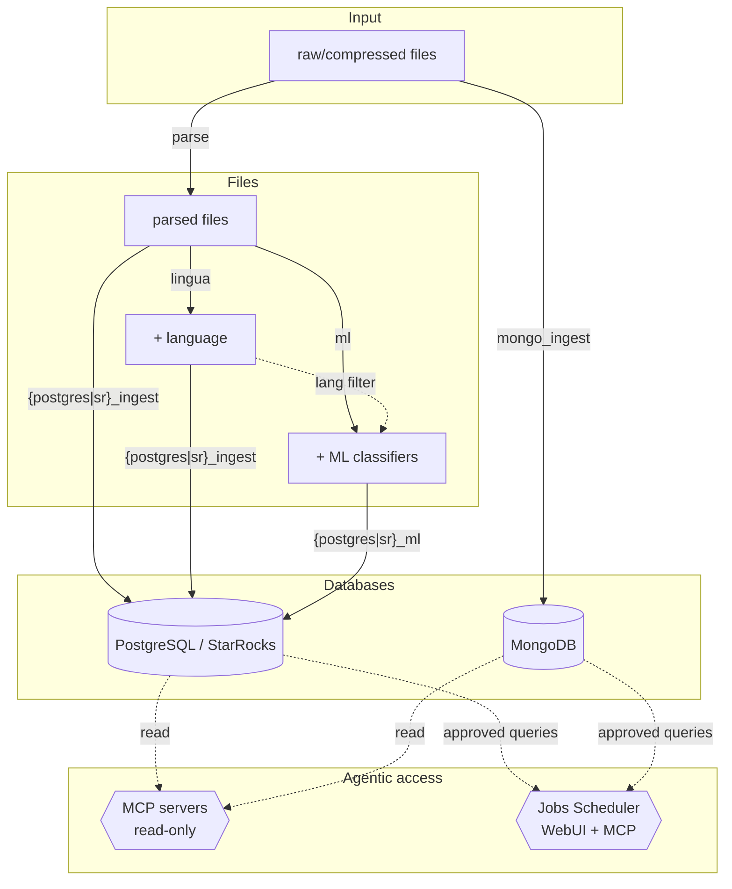
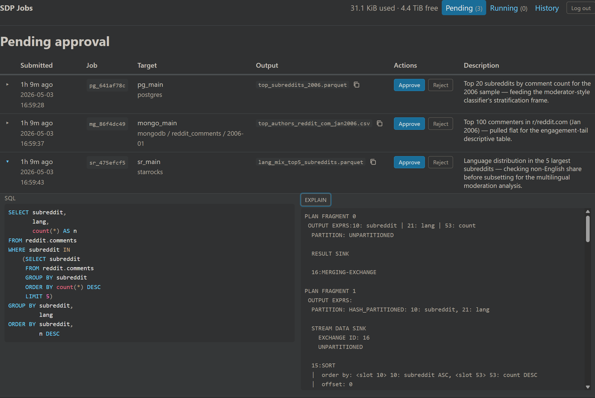

<div align="center">

# Social Data Pipeline

[](https://www.docker.com/)
[](https://www.python.org/)
[](https://www.postgresql.org/)
[](https://www.mongodb.com/)
[](https://www.starrocks.io/)
[](https://developer.nvidia.com/cuda-toolkit)
[](https://onnxruntime.ai/)

A researcher-focused, end-to-end CLI pipeline for processing, classifying, ingesting, and querying large-scale data dumps using performant databases. Interactive CLI setup and execution with extensive configuration options. Built for the [Reddit data dumps](https://github.com/ArthurHeitmann/arctic_shift) and supporting any high-volume record-based dataset (including [Hugging Face](https://huggingface.co/datasets)), with first-class agentic AI access.

</div>

### TL;DR

```bash
# 1. Configure databases (one-time)
python sdp.py db setup                      # Configure databases (interactive setup)
python sdp.py db setup-mcp                  # MCP servers for agentic AI data access (optional)
python sdp.py db setup-jobs                 # Job scheduler for agentic AI query submission (optional)
python sdp.py db start                      # Start databases and optional services

# 2. Add a source and process data
python sdp.py source add reddit             # Add a data source (interactive setup)
python sdp.py run parse                     # Decompress dumps → parse to cleaned, structured files
python sdp.py run lingua                    # Adds language detection to parsed files (if configured)

# 3. Ingest parsed files into PostgreSQL/MongoDB/StarRocks
python sdp.py run {postgres_ingest | mongo_ingest | sr_ingest}

# Runs & ingests ML data (optional, if configured)
python sdp.py run ml                        # Run ML GPU classifiers
python sdp.py run {postgres_ml | sr_ml}     # Ingest classifier outputs into PostgreSQL/StarRocks

# Check status
python sdp.py db status                     # Database status
python sdp.py source status                 # Ingestion source status
python sdp.py source error-logs             # Show error details for failed datasets
```

---

### Table of Contents

[◾ Overview](#-overview)
[◾ Requirements](#-requirements)
[◾ Quick Start](#-quick-start)
[◾ CLI Reference](#-cli-reference)
[◾ Profiles](#-profiles)
[◾ Platform Support](#-platform-support)
[◾ FAQ and Troubleshooting](#-faq-and-troubleshooting)

---

## ◾ Overview

**Social Data Pipeline** provides a complete pipeline for working with large-scale social media data dumps:

- **Multi-platform support** — [Reddit](https://github.com/ArthurHeitmann/arctic_shift) (with specialized features), custom JSON/CSV/Parquet platforms, or [Hugging Face datasets](https://huggingface.co/datasets)
- **Automatic detection and decompression** of `.zst`, `.gz`, `.xz`, and `.tar.gz` dump files
- **Parsing** JSON, CSV, and Parquet input to structured files (Parquet or CSV) with configurable field extraction
- **Modular classification** — CPU-based (Lingua) and GPU-based (transformers) with multi-GPU parallelization and language filtering
- **StarRocks ingestion** via the StarRocks OLAP engine for high-performance analytical queries
- **PostgreSQL ingestion** of parsed files with finetuned settings and duplicate handling
- **MongoDB ingestion** of raw JSON, CSV, and Parquet directly after extraction, for raw data inspection
- **Optional authentication** with admin and read-only database users
- **MCP servers** for PostgreSQL, MongoDB, and StarRocks, exposing read-only databases to agentic clients (Claude Code, Codex, etc.)
- **WebUI Job Scheduler** to approve and manage agent-created queries, with its own MCP for query submission

### Architecture



## ◾ Requirements

- [Python](https://www.python.org/) 3.10+ (for `sdp.py` CLI and setup scripts)
- [Docker Compose](https://docs.docker.com/compose/) v2

> [!TIP]
> **For GPU classification:** [NVIDIA Container Toolkit](https://docs.nvidia.com/datacenter/cloud-native/container-toolkit/install-guide.html)

**Recommended for optimal performance:**
- Flash-based storage (NVMe SSDs strongly recommended)
- High core count CPU (8+)
- 64GB+ RAM
- NVIDIA GPU with 8GB+ VRAM (for `ml` profile)

> [!NOTE]
> SM datasets can be very large, and ML classification can take days to months for the full datasets. Check the benchmarks at [joaopn/encoder-optimization-guide](https://github.com/joaopn/encoder-optimization-guide) to estimate runtimes on your hardware.

## ◾ Quick Start

#### 1. Configure (one-time)

```bash
python sdp.py db setup              # Configure databases — PostgreSQL, MongoDB, StarRocks (with optional auth)
python sdp.py db setup-mcp          # Read-only MCP servers for agentic clients (optional)
python sdp.py db setup-jobs         # Query scheduler — WebUI + MCP for human-approved agent queries (optional)
python sdp.py source add reddit     # Add a data source (interactive setup)
```

`db setup` walks you through database selection, data paths, port choices, optional authentication, and per-DB tuning (PGTune for PostgreSQL, FE/BE memory split for StarRocks). Run `db setup --add <db>` to add a new database later without reconfiguring existing ones. `source add` walks you through data types, file patterns, fields, indexes, and classifier configuration — generating per-source config in `config/sources/<name>/`.

`setup-mcp` and `setup-jobs` are optional but recommended for agentic workflows; they layer on top of `db setup` and reuse its read-only credentials. For details on each, see the [Database Profiles (MCP)](docs/profiles/database.md#mcp-servers) and [Jobs Scheduler](docs/profiles/jobs.md) docs.

For Reddit, download the data dumps from [Arctic Shift](https://github.com/ArthurHeitmann/arctic_shift/blob/master/download_links.md) and place them in the dumps directory configured during setup. For Hugging Face datasets, see [Platform Support](#-platform-support). For full configuration details, see the [Configuration Reference](docs/configuration.md).

#### 2. Run

```bash
python sdp.py db start                          # Start databases + MCPs + jobs (whatever's configured)
python sdp.py run parse --source reddit         # Decompress dumps → parse to structured files
python sdp.py run lingua --source reddit        # Optional: language detection (if configured during source add)
python sdp.py run ml --source reddit            # Optional: GPU transformer classifiers — toxicity, emotions, etc.
python sdp.py run sr_ingest --source reddit     # Ingest parsed files into StarRocks (or postgres_ingest / mongo_ingest)
python sdp.py run sr_ml --source reddit         # Optional: ingest classifier outputs into StarRocks (or postgres_ml)
```

`db start` brings up everything `db setup`/`setup-mcp`/`setup-jobs` configured — no separate command per service. The `--source` flag selects the target source (optional when only one is configured); `source add` prints the recommended run commands for your setup. Ordering rules for the optional enrichment + classifier-ingest steps: `lingua` should run before `*_ingest` so its language columns get folded into the main table; `ml` (GPU transformer classifiers) can run at any point after `parse` — its outputs are independent files; the `*_ml` profiles must run **after** their `*_ingest` counterpart, since classifier tables foreign-key into the main table. See [Classification Profiles](docs/profiles/classification.md) for tuning and the GPU requirements for `ml`. Use `python sdp.py source status` to check progress and `python sdp.py source error-logs` to inspect ingestion failures.

#### 3. Query

Three ways to use the data::

**Direct** — connect with any standard client:
- **PostgreSQL**: [psql](https://www.postgresql.org/docs/current/app-psql.html), [pgAdmin](https://www.pgadmin.org/), or [DBeaver](https://dbeaver.io/)
- **StarRocks**: any MySQL client (`mysql -h 127.0.0.1 -P 9030 -u root`), or from a growing list of [IDEs with official support](https://docs.starrocks.io/docs/cover_pages/ide_tools/)
- **MongoDB**: `mongosh`, [MongoDB Compass](https://www.mongodb.com/products/tools/compass)

**Agentic discovery (read-only MCP)** — short, ad-hoc Q&A from an AI agent. The per-DB MCP servers (started automatically alongside their database) expose read-only access to agentic clients like Claude Code, Codex, and Cursor. Best for quick queries to explore the dataset and schema and help the AI agent craft complex data analysis queries. Configured via `db setup-mcp`; see [Database Profiles → MCP Servers](docs/profiles/database.md#mcp-servers).

**Agentic execution (jobs scheduler)** — human-approved queries that produce result files. Agents call `submit_postgres_query` / `submit_starrocks_query` / `submit_mongo_query` over the jobs MCP at `http://localhost:8050/mcp`; you approve / reject / kill them in the WebUI at `http://localhost:8050/`. Long-running aggregations don't pollute the agent's context, and result files (Parquet / CSV / NDJSON) land in `JOBS_RESULT_ROOT/<job_id>/`. Configured via `db setup-jobs`; see the [Jobs Scheduler doc](docs/profiles/jobs.md).



---

<details>
<summary><h2>◾ CLI Reference</h2></summary>

All operations go through `sdp.py` with three command groups:

```
python sdp.py <db|source|run> [options]
```

### Database Management (`sdp.py db`)

| Command | Description |
|---------|-------------|
| `sdp.py db setup` | Configure databases (PostgreSQL, MongoDB, StarRocks, optional auth) — global, one-time |
| `sdp.py db setup --add <db>` | Add or reconfigure a single database (`postgres\|mongo\|starrocks`) without touching others |
| `sdp.py db setup-mcp` | Configure MCP servers for AI tool access (ports, read-only mode) |
| `sdp.py db setup-jobs` | Configure the query scheduler (jobs profile) — WebUI + MCP for agent query submission |
| `sdp.py db start [service]` | Start services: `postgres\|mongo\|starrocks\|postgres-mcp\|mongo-mcp\|starrocks-mcp\|jobs` (all if unspecified) |
| `sdp.py db stop [service]` | Stop services: `postgres\|mongo\|starrocks\|postgres-mcp\|mongo-mcp\|starrocks-mcp\|jobs` (all if unspecified) |
| `sdp.py db status` | Show database config, health, MCP, and jobs scheduler status |
| `sdp.py db recover-password` | Reset database admin password (requires auth enabled) |
| `sdp.py db create-indexes [--source <name>]` | Interactively create database indexes |
| `sdp.py db unsetup` | Remove database config; data deletion behind double confirmation |
| `sdp.py db unsetup --db <postgres\|mongo\|starrocks>` | Fully remove one database (config, containers, and data) without touching the others |
| `sdp.py db unsetup-mcp` | Remove MCP configuration and stop MCP containers |
| `sdp.py db unsetup-jobs` | Remove jobs scheduler configuration and stop the jobs container |

`db setup` generates `.env`, `config/db/*.yaml`, `config/postgres/postgresql.local.conf`, and `config/starrocks/{fe,be}.conf`. When authentication is enabled, it also generates `pg_hba.local.conf` and `.ro_credentials` files in each database data volume. `db setup --add <db>` adds or reconfigures a single database — it asks only that database's questions and merges into the existing `.env` without touching other databases' configuration. Database deletion in `db unsetup` requires two separate confirmations. `db unsetup --db <db>` is the inverse of `db setup --add` — it deletes exactly one database (containers, config files, data directory, and the DB's entries in `.env`, `docker-compose.override.yml`, and `config/db/mcp.yaml`) while leaving the other databases running. Data deletion is always included; to reconfigure a database in place without losing data, re-run `db setup --add <db>`.

### Source Management (`sdp.py source`)

| Command | Description |
|---------|-------------|
| `sdp.py source add <name>` | Add a new data source (interactive setup) |
| `sdp.py source add <name> --hf <dataset_id>` | Add from a Hugging Face dataset (fetches metadata as defaults) |
| `sdp.py source download <name>` | Download HF dataset files (mirrors to `data/dumps/`, organizes to `data/extracted/`) |
| `sdp.py source configure <name>` | Reconfigure existing source (platform-specific) |
| `sdp.py source add-classifiers <name>` | Add ML classifiers for a source |
| `sdp.py source remove <name>` | Remove source configuration |
| `sdp.py source list` | List configured sources |
| `sdp.py source status [name]` | Show source processing/ingestion status |
| `sdp.py source error-logs [name]` | Show database ingestion error logs |

`source add` walks you through platform selection, file patterns, fields, indexes, and optional classifier configuration. With `--hf`, it fetches HF dataset metadata (configs, fields, types) to pre-populate defaults — you still go through the full interactive setup. `source download` accepts `--token` for private datasets and `--data-type` to download selectively. All per-source config is written to `config/sources/<name>/`.

### Pipeline (`sdp.py run`)

| Command | Description |
|---------|-------------|
| `sdp.py run <profile>` | Run a pipeline profile |
| `sdp.py run <profile> --source <name>` | Run for a specific source (auto-selects if only one configured) |
| `sdp.py run <profile> --build` | Rebuild the Docker image before running |
| `sdp.py run <profile> --filter <pattern>` | Only process files matching pattern (fnmatch glob on file ID) |
| `sdp.py run parse --skip-lingua-files` | Parse only: also skip files that already have a lingua output (lets you delete old extracted/parsed files) |

Valid profiles: `parse`, `lingua`, `ml`, `postgres_ingest`, `postgres_ml`, `mongo_ingest`, `sr_ingest`, `sr_ml`. (The `jobs` profile is started via `sdp.py db start jobs`, not `sdp.py run`.) `--build` rebuilds the Docker image before running (needed after code or dependency changes). `--filter` (`-f`) restricts processing to files whose ID matches the given pattern (e.g. `--filter "*2024*"` for all 2024 months, `--filter "RS_2024-*"` for 2024 submissions only). `--skip-lingua-files` (parse only) treats `<OUTPUT_PATH>/lingua/<data_type>/<id>_lingua.{csv,parquet}` as an additional skip signal, so users running a `parse → lingua` workflow can delete old extracted/parsed files without parse re-decompressing them on the next run. The global `--tag` flag (e.g. `python sdp.py --tag db setup`) prefixes each interactive prompt with a `[tag_id]` for automation tools like pexpect.

`source status` reads pipeline state files to show ingestion progress (datasets processed, in-progress, failed) without querying the database. `source error-logs` shows the full error details and relevant mongoimport log output for failed datasets. Use `--profile` to filter by ingestion profile (`postgres_ingest`, `postgres_ml`, `mongo_ingest`, `sr_ingest`, `sr_ml`).

</details>

## ◾ Profiles

| Profile | Description | Input | Output |
|---------|-------------|-------|--------|
| `parse` | Decompress dumps, parse JSON/CSV/Parquet to Parquet/CSV | Compressed dump files, extracted JSON/CSV/Parquet | `PARSED_PATH/` |
| `lingua` | Lingua language detection (CPU) | Parsed files | `OUTPUT_PATH/lingua/` |
| `ml` | Transformer classifiers (GPU) | Parsed files + Lingua output | `OUTPUT_PATH/{classifier}/` |
| `postgres` | PostgreSQL database server | — | — |
| `postgres_ingest` | Ingest into PostgreSQL | Parsed files (or Lingua-enriched) | PostgreSQL tables |
| `postgres_ml` | Ingest ML outputs into PostgreSQL | Classifier output files | PostgreSQL tables |
| `mongo` | MongoDB database server | — | — |
| `mongo_ingest` | Ingest raw data into MongoDB | Extracted JSON/NDJSON/CSV/Parquet | MongoDB collections |
| `starrocks` | StarRocks OLAP database server | — | — |
| `sr_ingest` | Ingest parsed files into StarRocks | Parsed files (or Lingua-enriched) | StarRocks tables |
| `sr_ml` | Ingest ML outputs into StarRocks | Classifier output files | StarRocks tables |
| `jobs` | Query scheduler — WebUI + MCP for human-approved agent queries against PG/Mongo/StarRocks | SQL/aggregation submissions | `JOBS_RESULT_ROOT/<job_id>/` |

> [!NOTE]
> GPU profile requires [NVIDIA Container Toolkit](https://docs.nvidia.com/datacenter/cloud-native/container-toolkit/install-guide.html). All profiles track progress and resume automatically — rerun any profile safely without reprocessing completed files.

For detailed configuration and algorithm documentation, see the per-profile docs:
- [Parse Profile](docs/profiles/parse.md)
- [Classification Profiles (lingua / ml)](docs/profiles/classification.md)
- [Database Profiles (postgres / postgres_ingest / postgres_ml / mongo / mongo_ingest / starrocks / sr_ingest / sr_ml)](docs/profiles/database.md)
- [Jobs Scheduler (jobs)](docs/profiles/jobs.md)

## ◾ Platform Support

| Platform | Description |
|----------|-------------|
| `reddit` | Specialized Reddit features: waterfall deletion detection, id deduplication, base-36 ID conversion, [schema conversion](docs/platforms/reddit.md) (handles dump format drift across years — field renames, missing fields, lowercasing) |
| `<name>` | JSON, CSV, and Parquet parsing for arbitrary data: dot-notation, array indexing, type enforcement |

Platform is determined by source name: `sdp.py source add reddit` uses the Reddit platform, any other name uses the generic `<name>`. To process arbitrary JSON/NDJSON, CSV, or Parquet data, use any name other than `reddit` and configure your platform interactively.

### Hugging Face Datasets

Datasets hosted on [Hugging Face](https://huggingface.co/datasets) can be added directly:

```bash
python sdp.py source add mydata --hf user/dataset-name   # Fetches HF metadata as setup defaults
python sdp.py source download mydata                      # Download parquet files
python sdp.py run parse --source mydata                   # Parse (column selection, type enforcement)
python sdp.py run mongo_ingest --source mydata            # Ingest raw parquet into MongoDB
```

The `--hf` flag fetches dataset metadata (configs, fields, types) from the HF API and uses it to pre-populate the interactive setup. HF configs are grouped interactively into data types (e.g., grouping yearly configs into `comments` and `submissions`). `source download` mirrors the HF repo to `data/dumps/` and then organizes files into `data/extracted/` by data type. Files flow through the standard pipeline — `parse` handles column selection and type enforcement, `mongo_ingest` can ingest raw parquet directly. No additional local dependencies beyond `pyyaml`.

- [Reddit Platform Reference](docs/platforms/reddit.md)
- [Custom Platform Setup](docs/platforms/custom.md)

### Extending functionality

- **Add new platforms**: Create config files and an optional custom parser. See [Adding Platforms](docs/platforms/adding-platforms.md).
- **Add custom classifiers**: Config-only (add a HuggingFace model via YAML) or custom Python. See [Custom Classifiers](docs/guides/custom-classifiers.md).
- **Full configuration reference**: All environment variables, YAML files, and the source override system. See [Configuration](docs/configuration.md).

## ◾ FAQ and Troubleshooting

<details>
<summary><strong>Should I use PostgreSQL or StarRocks?</strong></summary>

Both ingest the same parsed files and support the same pipeline features (classifiers, lingua, MCP servers, authentication). The choice depends on your workload:

| | PostgreSQL | StarRocks |
|---|---|---|
| **Best for** | General-purpose queries, joins with external data, extensions (PostGIS, pg_parquet, pgvector) | Large-scale analytical queries (aggregations, scans, GROUP BY over billions of rows) |
| **Query speed** | Good with proper indexing; row-oriented storage | Much faster (~10X) for analytics; columnar storage with vectorized execution |
| **Ecosystem** | Mature, widely supported, connects to nearly everything | MySQL wire protocol — works with any MySQL client, but smaller ecosystem |
| **Extensibility** | Rich extension system (custom types, FDWs, procedural languages) | Limited — focused on analytics |
| **Storage model** | Row-oriented, B-tree indexes, tablespaces for multi-disk | Columnar, BITMAP indexes, built-in multi-disk via `storage_root_path` |
| **Ingestion** | Fast initial load (deferred PK), ON CONFLICT upsert | Single code path — Primary Key tables handle dedup natively |

**Use PostgreSQL** if you need a general-purpose database that integrates with other tools and workflows. **Use StarRocks** if your primary goal is fast analytical queries over large datasets. You can use both — they ingest independently from the same parsed files.

</details>

<details>
<summary><strong>Can I run classifiers without the database?</strong></summary>

Yes! Use `python sdp.py run lingua` or `python sdp.py run ml` independently. The database profiles are optional.

</details>

<details>
<summary><strong>Can I use this for non-Reddit data?</strong></summary>

Yes! Use a not-reserved (not `reddit`) name during `python sdp.py source add <name>` to process arbitrary NDJSON, CSV, or Parquet data. For Hugging Face datasets, use `python sdp.py source add <name> --hf <dataset_id>` to fetch metadata and pre-populate setup defaults. See the [Custom Platform](docs/platforms/custom.md) setup guide.

</details>

<details>
<summary><strong>How do I add custom support for a new platform?</strong></summary>

See [Adding New Platforms](docs/platforms/adding-platforms.md). Create a platform template in `config/templates/` and optionally a custom parser.

</details>

<details>
<summary><strong>How do I reprocess data?</strong></summary>

Delete the relevant output directories and rerun the profile:

```bash
rm -rf data/output/<source>/toxic_roberta/          # Reprocess a specific classifier
rm -rf data/output/<source>/                        # Reprocess all classifiers
rm -rf data/output/<source>/ data/parsed/<source>/ data/extracted/<source>/  # Full reprocess
```

</details>


### Troubleshooting

**Pipeline fails:**
```bash
docker compose logs parse
docker compose logs lingua
docker compose logs postgres-ingest
docker compose logs sr-ingest
docker compose logs postgres-ml
docker compose logs sr-ml
```

**Database connection issues:**
```bash
docker compose ps
docker compose logs postgres
docker compose logs mongo
docker compose --profile starrocks logs starrocks
```

**Out of disk space:**
- Use `cleanup_temp: true` in pipeline.yaml
- Check temp directories for leftover files
- Consider sequential mode to reduce intermediate storage

**GPU not detected:**
```bash
docker run --rm --gpus all nvidia/cuda:12.1.1-base-ubuntu22.04 nvidia-smi
```

---

## AI disclaimer

Most of the orchestration and dockerization glue code was written by LLMs, under human planning, code review, and [extensive testing](docs/guides/testing.md). The algorithms and ingestion structure are a merge of a number of private repos developed over a period of almost 4 years.

## License

See LICENSE file.
