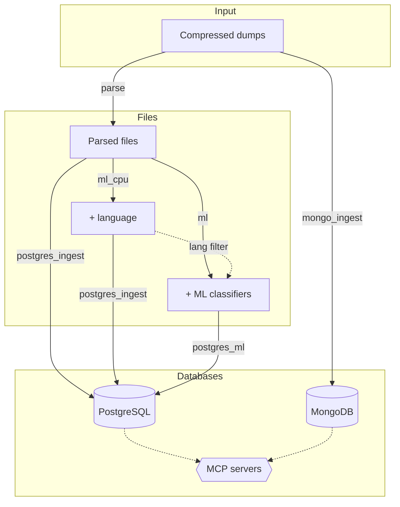

<div align="center">

# Social Data Bridge

[](https://www.docker.com/)
[](https://www.python.org/)
[](https://www.postgresql.org/)
[](https://www.mongodb.com/)
[](https://developer.nvidia.com/cuda-toolkit)
[](https://onnxruntime.ai/)

A toolkit for large-scale processing, ML classification, and database ingestion of social media data dumps. Supports PostgreSQL and MongoDB as database destinations, and bundles MCP servers for AI tool access. Designed for the [Reddit data dumps](https://github.com/ArthurHeitmann/arctic_shift), with support for multiple platforms through a configurable architecture.

</div>

### TL;DR

```bash
# 1. Configure databases
python sdb.py db setup                      # Configure PostgreSQL/MongoDB (one-time)
python sdb.py db start                      # Start database(s)

# 2. Add a source and run desired tasks
python sdb.py source add reddit             # Add a data source (interactive setup)
python sdb.py run parse                     # Decompress dumps → parse to structured files
python sdb.py run postgres_ingest           # Ingest parsed files into PostgreSQL
python sdb.py run mongo_ingest              # Ingest raw data into MongoDB

# OPTIONAL services
python sdb.py run ml_cpu                    # Adds language detection to files
python sdb.py db mcp                        # MCP servers for AI tool access
python sdb.py run ml                        # GPU classifiers (toxicity, emotions)
python sdb.py run postgres_ml               # Ingest classifier outputs

# Check status
python sdb.py db status                     # Database status
python sdb.py source status                 # Ingestion source status
```

---

### Table of Contents

[◾ Overview](#-overview)
[◾ Requirements](#-requirements)
[◾ Quick Start](#-quick-start)
[◾ CLI Reference](#-cli-reference)
[◾ Profiles](#-profiles)
[◾ Platform Support](#-platform-support)
[◾ Storage Requirements](#-storage-requirements)
[◾ FAQ and Troubleshooting](#-faq-and-troubleshooting)

---

## ◾ Overview

**Social Data Bridge** provides a complete pipeline for working with large-scale social media data dumps:

- **Multi-platform support** — Reddit (with specialized features) or custom JSON platforms
- **Automatic detection and decompression** of `.zst`, `.gz`, `.xz`, and `.tar.gz` dump files
- **Parsing** JSON to structured files (Parquet or CSV) with configurable field extraction
- **Modular classification** — CPU-based (Lingua) and GPU-based (transformers) with multi-GPU parallelization and language filtering
- **PostgreSQL ingestion** of parsed files with finetuned settings and duplicate handling
- **MongoDB ingestion** of raw JSON/NDJSON directly after extraction, using `mongoimport` for fast bulk loading
- **Optional authentication** with admin, read-only, and MCP-specific database users
- **MCP servers** for PostgreSQL and MongoDB, exposing databases to AI tools (Claude Desktop, VS Code, Cursor)
- **Config-based** addition of new classifiers, platforms, and database backends

### Architecture



## ◾ Requirements

- [Python](https://www.python.org/) 3.10+ (for `sdb.py` CLI and setup scripts)
- [Docker Compose](https://docs.docker.com/compose/) v2
- Sufficient storage (see [Storage Requirements](#-storage-requirements))

> [!TIP]
> **For GPU classification:** [NVIDIA Container Toolkit](https://docs.nvidia.com/datacenter/cloud-native/container-toolkit/install-guide.html)

**Recommended for optimal performance:**
- Flash-based storage (NVMe SSDs strongly recommended)
- High core count CPU (8+)
- 64GB+ RAM
- NVIDIA GPU with 8GB+ VRAM (for `ml` profile)

> [!NOTE]
> The datasets are very large, and ML classification can take days to months for the full dataset. Check the benchmarks at [joaopn/encoder-optimization-guide](https://github.com/joaopn/encoder-optimization-guide) to estimate runtimes on your hardware.

## ◾ Quick Start

### Reddit Data (Default)

#### 1. Get monthly data dumps

Download the Reddit data dumps from [arctic_shift](https://github.com/ArthurHeitmann/arctic_shift/blob/master/download_links.md) and place the torrent directory in `data/dumps/reddit/`:

```
data/dumps/reddit/
├── submissions/
│   ├── RS_2024-01.zst
│   └── RS_2024-02.zst
└── comments/
    ├── RC_2024-01.zst
    └── RC_2024-02.zst
```

#### 2. Configure

Set up databases and add Reddit as a data source:

```bash
python sdb.py db setup              # Configure databases (PostgreSQL, MongoDB)
python sdb.py source add reddit     # Add Reddit source (interactive setup)
```

`db setup` configures database connections, generates `.env`, `config/db/*.yaml`, and `postgresql.local.conf` (with optional [PGTune](https://pgtune.leopard.in.ua/) integration). `source add` walks you through platform selection, file patterns, fields, indexes, and classifier configuration — generating per-source config in `config/sources/reddit/`.

For manual configuration or to understand what each setting does, see the [Configuration Reference](docs/configuration.md).

#### 3. Run

Run the desired profiles. The setup prints the commands for your selection, but the full pipeline is:

```bash
python sdb.py run parse              # Parse Reddit data to structured files
python sdb.py run ml_cpu             # CPU language detection (Lingua)
python sdb.py run ml                 # GPU classifiers (optional, requires NVIDIA GPU)
python sdb.py db start               # Start configured database(s)
python sdb.py run postgres_ingest    # Ingest parsed files into PostgreSQL
python sdb.py run postgres_ml        # Ingest classifier outputs into PostgreSQL
python sdb.py run mongo_ingest       # Ingest raw JSON into MongoDB
```

Use `python sdb.py source status` to check processing and ingestion progress at any time. When multiple sources are configured, use `--source` to target a specific one (e.g., `python sdb.py run parse --source reddit`).

#### 4. Analyze

With an optimized PostgreSQL database running, you can send large-scale analytical queries through:
- The terminal with [psql](https://www.postgresql.org/docs/current/app-psql.html)
- A GUI with [pgAdmin](https://www.pgadmin.org/) or [DBeaver](https://dbeaver.io/)
- AI tools via the built-in MCP servers (see below)

**MCP servers** (optional) expose your databases to AI tools like Claude Desktop, VS Code, and Cursor:

```bash
python sdb.py db mcp                 # Configure MCP servers (ports, read-only mode)
python sdb.py db start               # Starts databases + MCP servers together
```

**Database authentication** (optional) adds password-protected admin access, a read-only MCP user, and an optional passwordless read-only convenience user:

```bash
# Enable during initial setup — or re-run to add auth to existing databases
python sdb.py db setup               # Select "Enable database authentication"
```

> [!NOTE]
> By default, databases accept local, unauthenticated connections. Authentication is optional and can be enabled at any time. See the [Database Profiles](docs/profiles/database.md#authentication) docs for details.

---

<details>
<summary><h2>◾ CLI Reference</h2></summary>

All operations go through `sdb.py` with three command groups:

```
python sdb.py <db|source|run> [options]
```

### Database Management (`sdb.py db`)

| Command | Description |
|---------|-------------|
| `sdb.py db setup` | Configure databases (PostgreSQL, MongoDB, optional auth) — global, one-time |
| `sdb.py db mcp` | Configure MCP servers for AI tool access (ports, read-only mode) |
| `sdb.py db mcp --delete` | Remove MCP configuration |
| `sdb.py db start [postgres\|mongo]` | Start database services + MCP servers (all configured if unspecified) |
| `sdb.py db stop [postgres\|mongo]` | Stop database services + MCP servers (all configured if unspecified) |
| `sdb.py db status` | Show database config, health, and MCP status |
| `sdb.py db recover-password` | Reset database admin password (requires auth enabled) |
| `sdb.py db unsetup` | Remove database config; data deletion behind double confirmation |

`db setup` generates `.env`, `config/db/*.yaml`, and `config/postgres/postgresql.local.conf`. When authentication is enabled, it also generates `pg_hba.local.conf` and MCP credential files. Database deletion in `db unsetup` requires two separate confirmations.

### Source Management (`sdb.py source`)

| Command | Description |
|---------|-------------|
| `sdb.py source add <name>` | Add a new data source (interactive setup) |
| `sdb.py source configure <name>` | Reconfigure existing source (platform-specific) |
| `sdb.py source add-classifiers <name>` | Add ML classifiers for a source |
| `sdb.py source remove <name>` | Remove source configuration |
| `sdb.py source list` | List configured sources |
| `sdb.py source status [name]` | Show source processing/ingestion status |

`source add` walks you through platform selection, file patterns, fields, indexes, and optional classifier configuration. All per-source config is written to `config/sources/<name>/`.

### Pipeline (`sdb.py run`)

| Command | Description |
|---------|-------------|
| `sdb.py run <profile>` | Run a pipeline profile |
| `sdb.py run <profile> --source <name>` | Run for a specific source (auto-selects if only one configured) |
| `sdb.py run <profile> --build` | Rebuild the Docker image before running |

Valid profiles: `parse`, `ml_cpu`, `ml`, `postgres_ingest`, `postgres_ml`, `mongo_ingest`.

`source status` reads pipeline state files to show ingestion progress (datasets processed, in-progress, failed) without querying the database.

</details>

## ◾ Profiles

| Profile | Description | Input | Output |
|---------|-------------|-------|--------|
| `parse` | Decompress dumps, parse JSON to Parquet/CSV | Compressed dump files (`.zst`, `.gz`, `.xz`, `.tar.gz`) | `CSV_PATH/` |
| `ml_cpu` | Lingua language detection (CPU) | Parsed files | `OUTPUT_PATH/lingua/` |
| `ml` | Transformer classifiers (GPU) | Parsed files + Lingua output | `OUTPUT_PATH/{classifier}/` |
| `postgres` | PostgreSQL database server | — | — |
| `postgres_ingest` | Ingest into PostgreSQL | Parsed files (or Lingua-enriched) | PostgreSQL tables |
| `postgres_ml` | Ingest ML outputs into PostgreSQL | Classifier output files | PostgreSQL tables |
| `mongo` | MongoDB database server | — | — |
| `mongo_ingest` | Ingest raw JSON into MongoDB | Extracted JSON/NDJSON | MongoDB collections |

> [!NOTE]
> GPU profile requires [NVIDIA Container Toolkit](https://docs.nvidia.com/datacenter/cloud-native/container-toolkit/install-guide.html). All profiles track progress and resume automatically — rerun any profile safely without reprocessing completed files.

For detailed configuration and algorithm documentation, see the per-profile docs:
- [Parse Profile](docs/profiles/parse.md)
- [Classification Profiles (ml_cpu / ml)](docs/profiles/classification.md)
- [Database Profiles (postgres / postgres_ingest / postgres_ml / mongo / mongo_ingest)](docs/profiles/database.md)

## ◾ Platform Support

| Platform | Description | Default |
|----------|-------------|---------|
| `reddit` | Specialized Reddit features: waterfall deletion detection, base-36 ID conversion, format compatibility | Yes |
| `custom/<name>` | JSON parsing for arbitrary data: dot-notation, array indexing, type enforcement | No |

The default platform is Reddit. To process arbitrary JSON/NDJSON data, select `custom` during `sdb.py source add` and configure your platform interactively.

- [Reddit Platform Reference](docs/platforms/reddit.md)
- [Custom Platform Setup](docs/platforms/custom.md)

### Extending functionality

- **Add new platforms**: Create config files and an optional custom parser. See [Adding Platforms](docs/platforms/adding-platforms.md).
- **Add custom classifiers**: Config-only (add a HuggingFace model via YAML) or custom Python. See [Custom Classifiers](docs/guides/custom-classifiers.md).
- **Full configuration reference**: All environment variables, YAML files, and the source override system. See [Configuration](docs/configuration.md).

## ◾ Storage Requirements

Storage needs depend on pipeline mode and selected fields (estimates for full Reddit dumps):

| Component | Sequential Mode | Parallel Mode |
|-----------|-----------------|---------------|
| Intermediate files | ~4TB | ~51TB |
| With ZFS/BTRFS compression | ~4TB | ~9TB |
| PostgreSQL database | ~10TB (uncompressed) | ~6TB (LZ4) |

See [Database Profiles](docs/profiles/database.md#storage-requirements) for details on pipeline modes.

**Multi-disk setups:** If your database doesn't fit on a single drive, use [PostgreSQL tablespaces](docs/profiles/database.md#tablespaces) to spread tables across multiple disks. Run `python sdb.py db setup` to configure tablespaces interactively.

## ◾ FAQ and Troubleshooting

<details>
<summary><strong>Can I run classifiers without the database?</strong></summary>

Yes! Use `python sdb.py run ml_cpu` or `python sdb.py run ml` independently. The database profile is optional.

</details>

<details>
<summary><strong>Can I use this for non-Reddit data?</strong></summary>

Yes! Select `custom` during `python sdb.py source add <name>` to process arbitrary JSON/NDJSON data. See the [Custom Platform](docs/platforms/custom.md) setup guide.

</details>

<details>
<summary><strong>How do I add support for a new platform?</strong></summary>

See [Adding New Platforms](docs/platforms/adding-platforms.md). Create a platform template in `config/templates/` and optionally a custom parser.

</details>

<details>
<summary><strong>How do I reprocess data?</strong></summary>

Delete the relevant output directories and rerun the profile:

```bash
rm -rf data/output/<source>/toxic_roberta/          # Reprocess a specific classifier
rm -rf data/output/<source>/                        # Reprocess all classifiers
rm -rf data/output/<source>/ data/csv/<source>/ data/extracted/<source>/  # Full reprocess
```

</details>

<details>
<summary><strong>Why no table partitioning?</strong></summary>

This project targets large-scale, Reddit-wide analysis. For queries not limited to a few months, partitioning would split indexes into 200+ partitions, hurting query performance. It would also interfere with ID deduplication during ingestion.

</details>

### Troubleshooting

**Pipeline fails:**
```bash
docker compose logs parse
docker compose logs ml_cpu
docker compose logs postgres-ingest
docker compose logs postgres-ml
```

**Database connection issues:**
```bash
docker compose ps
docker compose logs postgres
docker compose logs mongo
```

**Out of disk space:**
- Ensure `cleanup_temp: true` in pipeline.yaml
- Check temp directories for leftover files
- Consider sequential mode to reduce intermediate storage

**GPU not detected:**
```bash
docker run --rm --gpus all nvidia/cuda:12.1.1-base-ubuntu22.04 nvidia-smi
```

---

## AI disclaimer

Most of the orchestration and dockerization glue code was written by LLMs, under human planning and code review. The algorithms and ingestion structure are a merge of a number of private repos developed over a period of almost 4 years.

## License

See LICENSE file.
