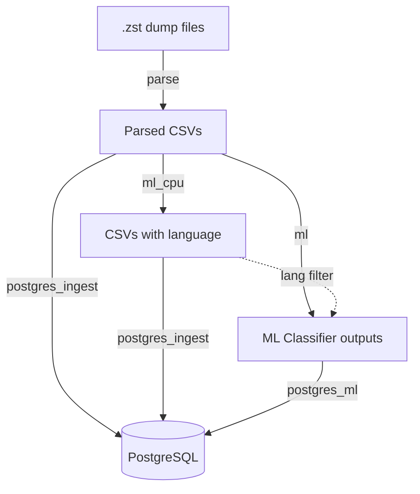

# Social Data Bridge

A Docker-based toolkit for large-scale processing, classification, and database ingestion of social media data dumps. Designed for the [Reddit data dumps](https://github.com/ArthurHeitmann/arctic_shift), with support for multiple platforms through a configurable architecture.

## Table of Contents

- [Overview](#overview)
- [Requirements](#requirements)
- [Quick Start](#quick-start)
- [CLI Reference](#cli-reference)
- [Profiles](#profiles)
- [Platform Support](#platform-support)
- [Storage Requirements](#storage-requirements)
- [FAQ and Troubleshooting](#faq-and-troubleshooting)

## Overview

**Social Data Bridge** is a Docker-based monorepo that provides a complete pipeline for working with large-scale social media data dumps:

- **Multi-platform support** - Reddit (with specialized features) or generic JSON/CSV processing
- **Automatic detection and decompression** of `.zst` dump files
- **Parsing** JSON to clean CSVs with configurable field extraction
- **Modular classification** - CPU-based (Lingua) and GPU-based (transformers) with
    - **Multi-GPU parallelization** for transformer classifiers
    - **Language filtering** - optionally classify only specific languages
- **PostgreSQL ingestion** with finetuned settings and duplicate handling
- **Config-based** addition of new classifiers, platforms, and database backends

### Architecture



## Requirements

- [Docker Compose](https://docs.docker.com/compose/)
- Sufficient storage (see [Storage Requirements](#storage-requirements))
- **For GPU classification**: [NVIDIA Container Toolkit](https://docs.nvidia.com/datacenter/cloud-native/container-toolkit/install-guide.html)

**Recommended for optimal performance:**
- Flash-based storage (NVMe SSDs strongly recommended)
- High core count CPU (8+)
- 64GB+ RAM
- NVIDIA GPU with 8GB+ VRAM (for `ml` profile)

**Note**: The datasets are very large, and ML classification on them can take a long time (days-months for the full dataset). You can check the benchmarks at [joaopn/encoder-optimization-guide](https://github.com/joaopn/encoder-optimization-guide) to estimate how long they can take on your hardware and target data.

## Quick Start

### Reddit Data (Default)

#### 1. Get monthly data dumps

Download the Reddit data dumps from [arctic_shift](https://github.com/ArthurHeitmann/arctic_shift/blob/master/download_links.md) and place the torrent directory in `data/dumps/`:

```bash
data/dumps/
├── submissions/
│   ├── RS_2024-01.zst
│   └── RS_2024-02.zst
└── comments/
    ├── RC_2024-01.zst
    └── RC_2024-02.zst
```

#### 2. Configure

Run the interactive setup to auto-detect your hardware and generate all configuration files:

```bash
python sdb.py setup
```

The setup walks you through core settings (paths, parse, PostgreSQL), optionally classifier tuning, and Reddit-specific field/index configuration — all with sensible defaults. It generates `.env`, `user.yaml` for each profile, and `postgresql.local.conf` (with optional [PGTune](https://pgtune.leopard.in.ua/) integration).

For manual configuration or to understand what each setting does, see the [Configuration Reference](docs/configuration.md).

#### 3. Run

Run the profiles in order. The setup prints the commands for your selection, but the full pipeline is:

```bash
# Parse Reddit data to CSV
python sdb.py run parse

# CPU language detection (Lingua)
python sdb.py run ml_cpu

# GPU classifiers (optional, requires NVIDIA GPU)
python sdb.py run ml

# Start database
python sdb.py start

# Ingest main files
python sdb.py run postgres_ingest

# Ingest files from GPU classifiers
python sdb.py run postgres_ml
```

Use `python sdb.py status` to check configuration and ingestion progress at any time.

#### 4. Analyze

With an optimized PosgreSQL database running, you can now send large-scale analytical queries through a variety of means
- from the terminal with [psql](https://www.postgresql.org/docs/current/app-psql.html)
- from a GUI with e.g. [pgAdmin](https://www.pgadmin.org/) or [DBeaver](https://dbeaver.io/)
- Using LLMs with MCP servers such as [crystaldba/postgres-mcp](https://github.com/crystaldba/postgres-mcp)
- With agentic LLMs using e.g. [Agent Skills](https://platform.claude.com/docs/en/agents-and-tools/agent-skills/overview)

**Important**: by default, the database accepts local, read-write, unauthenticated connections with user `postgres`. For multiple users (human or AI), it is recommended to add a password or read-only users. 

## CLI Reference

All operations go through `sdb.py`:

```
python sdb.py <command> [options]
```

### Configuration

| Command | Description |
|---------|-------------|
| `sdb.py setup` | Full interactive configuration: core → classifiers → platform |
| `sdb.py setup-reddit` | Configure Reddit fields, indexes, and schema |
| `sdb.py add-classifiers` | Configure Lingua and GPU classifier settings |
| `sdb.py unsetup` | Remove all generated configuration and optionally delete the database |

`setup` is the main entrypoint — it runs core configuration first, then optionally walks you through classifier and platform setup. The individual commands (`setup-reddit`, `add-classifiers`) can be re-run independently to update specific settings.

`unsetup` removes all generated files (`.env`, `user.yaml` overrides, `setup_state.yaml`, etc.). Database deletion requires two separate confirmations. Data files (CSVs, dumps, classifier outputs) are never deleted — their locations are printed for manual cleanup.

### Pipeline

| Command | Description |
|---------|-------------|
| `sdb.py run <profile>` | Run a pipeline profile |
| `sdb.py run <profile> --build` | Rebuild the Docker image before running |
| `sdb.py start` | Start the PostgreSQL database |
| `sdb.py stop` | Stop the PostgreSQL database |
| `sdb.py status` | Show configuration and ingestion progress |

Valid profiles: `parse`, `ml_cpu`, `ml`, `postgres_ingest`, `postgres_ml`.

`status` reads pipeline state files to show ingestion progress (datasets processed, in-progress, failed) without querying the database.

## Profiles

| Profile | Description | Input | Output |
|---------|-------------|-------|--------|
| `parse` | Decompress `.zst`, parse JSON to CSV | `.zst` dump files | `CSV_PATH/` |
| `ml_cpu` | Lingua language detection (CPU) | Parsed CSVs | `OUTPUT_PATH/lingua/` |
| `ml` | Transformer classifiers (GPU) | Parsed CSVs + Lingua output | `OUTPUT_PATH/{classifier}/` |
| `postgres` | PostgreSQL database server | - | - |
| `postgres_ingest` | Ingest CSVs into PostgreSQL | Parsed CSVs (or Lingua CSVs) | PostgreSQL tables |
| `postgres_ml` | Ingest ML outputs into PostgreSQL | Classifier output CSVs | PostgreSQL tables |

**Note:** GPU profile requires [NVIDIA Container Toolkit](https://docs.nvidia.com/datacenter/cloud-native/container-toolkit/install-guide.html). All profiles track progress and resume automatically — rerun any profile safely without reprocessing completed files.

For detailed configuration and algorithm documentation, see the per-profile docs:
- [Parse Profile](docs/profiles/parse.md)
- [Classification Profiles (ml_cpu / ml)](docs/profiles/classification.md)
- [Database Profiles (postgres / postgres_ingest / postgres_ml)](docs/profiles/database.md)

## Platform Support

| Platform | Description | Default |
|----------|-------------|---------|
| `reddit` | Specialized Reddit features: waterfall deletion detection, base-36 ID conversion, format compatibility | Yes |
| `generic` | Simple JSON-to-CSV for arbitrary data: dot-notation, array indexing, type enforcement | No |

The default platform is Reddit. To process arbitrary JSON/NDJSON data, select `generic` during `sdb.py setup` and configure field lists, field types, and file patterns.

- [Reddit Platform Reference](docs/platforms/reddit.md)
- [Generic Platform Setup](docs/platforms/generic.md)

### Extending functionality

- **Add new platforms**: Create config files and an optional custom parser. See [Adding Platforms](docs/platforms/adding-platforms.md).
- **Add custom classifiers**: Config-only (add a HuggingFace model via YAML) or custom Python. See [Custom Classifiers](docs/guides/custom-classifiers.md).
- **Full configuration reference**: All environment variables, YAML files, and the user.yaml override system. See [Configuration](docs/configuration.md).

## Storage Requirements

Storage needs depend on pipeline mode and selected fields (estimates for full Reddit dumps):

| Component | Sequential Mode | Parallel Mode |
|-----------|-----------------|---------------|
| Intermediate files | ~4TB | ~51TB |
| With ZFS/BTRFS compression | ~4TB | ~9TB |
| PostgreSQL database | ~10TB (uncompressed) | ~6TB (LZ4) |

See [Database Profiles](docs/profiles/database.md#storage-requirements) for details on pipeline modes.

**Multi-disk setups:** If your database doesn't fit on a single drive, use [PostgreSQL tablespaces](docs/profiles/database.md#tablespaces) to spread tables across multiple disks. Run `python sdb.py setup` to configure tablespaces interactively.

## FAQ and Troubleshooting

#### Can I run classifiers without the database?

Yes! Use `python sdb.py run ml_cpu` or `python sdb.py run ml` independently. The database profile is optional.

#### Can I use this for non-Reddit data?

Yes! Use `PLATFORM=generic` to process arbitrary JSON/NDJSON data. See the [Generic Platform](docs/platforms/generic.md) setup guide.

#### How do I add support for a new platform?

See [Adding New Platforms](docs/platforms/adding-platforms.md). Create configuration files in `config/platforms/{platform}/` and optionally a custom parser.

#### How do I reprocess data?

Delete the relevant output directories and rerun the profile:

```bash
rm -rf data/output/toxic_roberta/   # Reprocess a specific classifier
rm -rf data/output/                  # Reprocess all classifiers
rm -rf data/output/ data/csv/ data/extracted/  # Full reprocess
```

#### Why no table partitioning?

This project targets large-scale, Reddit-wide analysis. For queries not limited to a few months, partitioning would split indexes into 200+ partitions, hurting query performance. It would also interfere with ID deduplication during ingestion.

### Troubleshooting

Pipeline Fails:

```bash
# Check logs
docker compose logs parse
docker compose logs ml_cpu
docker compose logs postgres-ingest
docker compose logs postgres-ml
```

PostgreSQL Connection Issues:

```bash
docker compose ps
docker compose logs postgres
```

Out of Disk Space:

- Ensure `cleanup_temp: true` in pipeline.yaml
- Check temp directories for leftover files
- Consider sequential mode to reduce intermediate storage

GPU Not Detected:

Verify NVIDIA Container Toolkit is installed:
```bash
docker run --rm --gpus all nvidia/cuda:12.1.1-base-ubuntu22.04 nvidia-smi
```

## AI disclaimer

Most of the orchestration and dockerization glue code was written by LLMs, under human planning and code review. The algorithms and ingestion structure are a merge of a number of private repos developed over a period of almost 4 years.

## License

See LICENSE file.
